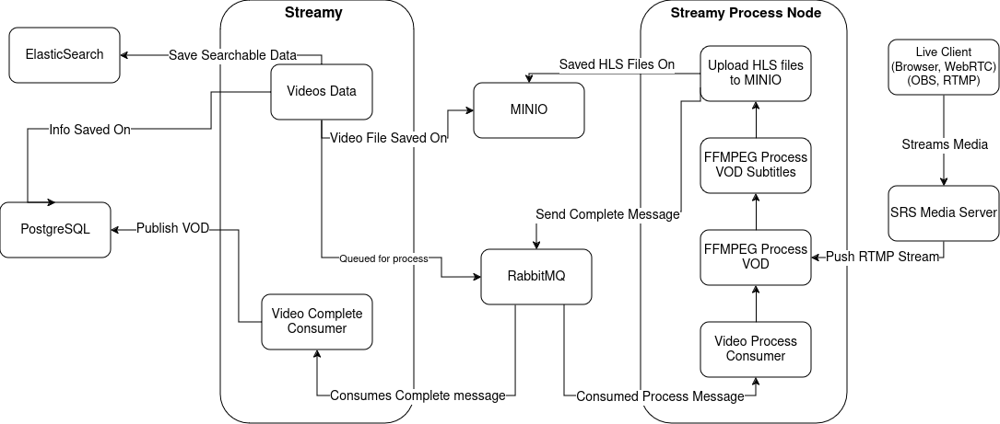

> [!WARNING]
> **This repository is deprecated and archived.**
> The process node now lives in the [streamy monorepo](https://github.com/miadabdi/streamy)
> at `apps/worker`. This repo's full git history was merged there — nothing was lost.
> All development, issues and CI happen in the monorepo from here on.

# Streamy Process Node

This is a process node for [Streamy](https://github.com/miadabdi/streamy). The purpose of a dedicated process node is to allow any number of processing nodes to run on separate servers, decoupling these tasks from user request handling.

# How It Works



The Streamy project is responsible for handling user requests and managing various functionalities such as video creation, channels, comments, profiles, and more.

There is a different project, [Streamy Process Node](https://github.com/miadabdi/streamy_process_node) responsible for running long processes.

The [Streamy Process Node](https://github.com/miadabdi/streamy_process_node) takes on the responsibility of executing long-running processes. Here's how it works:

Video Uploads:

1. When a video is confirmed uploaded, Streamy sends a message to the Process Node containing the video details.
2. The Process Node downloads the video from object storage (SeaweedFS S3 gateway).
3. It then processes and transcodes the video into HLS (HTTP Live Streaming) format.

Live Streaming:

1. When a new stream hits SRS (Simple Realtime Server), it is handed over to the Process Node.
2. The node transcodes the stream into HLS format as well using FFMPEG.

This separation of concerns ensures that user interactions remain responsive, while the heavy lifting of video processing is handled efficiently by dedicated nodes.

## Running

Two supported ways:

### Option A: as part of the Streamy stack (recommended)

The worker runs as the `process_node` service in the [Streamy](https://github.com/miadabdi/streamy) repo's `docker-compose-dev.yml` / `docker-compose-prod.yml`, with the build context pointing at this repo cloned side by side (`../streamy_process_node`). One `docker compose up` in the streamy repo brings up the API, the worker, RabbitMQ, SeaweedFS, Postgres and Elasticsearch together. Inside the container ffmpeg/ffprobe come from the distro package (`FFMPEG_PATH=ffmpeg`).

### Option B: bare metal

```bash
chmod 755 setup.sh
./setup.sh   # downloads static ffmpeg/ffprobe into binaries/ and runs npm install
cp .env.example .env   # then fill in RMQ_URL, MINIO_* pointing at your SeaweedFS/MinIO-compatible gateway
npm run start:dev
```

`binaries/` is gitignored; `setup.sh` re-fetches it (amd64 linux only).

### Environment variables

| Variable | Description |
| --- | --- |
| `NODE_ENV` | development / production |
| `PORT` | HTTP port (default 3001) — health endpoints only |
| `MINIO_ENDPOINT`, `MINIO_PORT`, `MINIO_ACCESS_KEY`, `MINIO_SECRET_KEY` | SeaweedFS S3 gateway address and credentials |
| `RMQ_URL` | RabbitMQ connection string |
| `FFMPEG_PATH`, `FFPROBE_PATH` | override binary locations (default `<cwd>/binaries/`) |
| `FFMPEG_THREAD_COUNT` | threads per ffmpeg process (default 8) |
| `FFMPEG_NICENESS`, `FFMPEG_LIVE_NICENESS` | nice values for VOD / live transcoding |

## HTTP surface

The worker exposes health endpoints only (documented in Swagger at `/api`):

- `GET /api/v1/health/liveness` — process uptime, zero external IO (compose healthcheck target)
- `GET /api/v1/health/readiness` — RabbitMQ connection state, storage probe, current in-flight job

## Queue contract

Consumes `q.video.process` and `q.live.process`; publishes status transitions on `q.set.video.status`. All queues are declared with a dead-letter exchange (`dlx`); messages whose handler throws are nacked (no requeue) and land on `q.dead_letter` for inspection. Domain failures (failed transcodes) are reported via `q.set.video.status` as `failed_in_processing` with ffmpeg logs, not via the DLQ.

# Details of video processing

### Command 1: VOD Processing

The first command takes the uploaded video as input and outputs three variants of the video, each with its associated M3U8 files and a final master M3U8 file. These variants are created in different qualities and resolutions to enable adaptive bitrate streaming for the user.

- Resolutions: The uploaded 1080p video is resized to 1080p, 720p, and 360p.
- Bitrates: Each variant is assigned a suitable bitrate to balance file size and quality. These bitrates can be adjusted as needed without breaking the process.
- Video Codec: The H.264 codec (libx264) is used. H.265 (HEVC) can be used in newer versions of HLS if desired.
- Audio Codec: The AAC codec is used for audio.
- Segmentation: Using the single_file option, segmentation is done through byte range instead of creating separate segments.

These steps ensure that the video player can provide adaptive bitrate streaming, delivering the best possible quality based on the user's network conditions.

```bash
ffmpeg -hide_banner -loglevel info -y -threads 8 -i ./video.mp4  -codec:v libx264 -crf:v 23 -profile:v high -pix_fmt:v yuv420p -rc-lookahead:v 40 -force_key_frames:v expr:'gte(t,n_forced*2.000)' -preset:v "veryfast" -b-pyramid:v "strict"   -filter_complex "[0:v]fps=fps=30,split=3[v1][v2][v3];[v1]scale=width=-2:height=1080[1080p];[v2]scale=width=-2:height=720[720p];[v3]scale=width=-2:height=360[360p]"  -map "[1080p]" -maxrate:v:0 2500000 -bufsize:v:0 5000000 -level:v:0 4.0  -map "[720p]" -maxrate:v:1 1700000 -bufsize:v:1 3200000 -level:v:1 3.1  -map "[360p]" -maxrate:v:2 800000 -bufsize:v:2 1600000 -level:v:2 3.1  -codec:a aac -ar 44100 -ac:a 2  -map 0:a:0 -b:a:0 192000  -map 0:a:0 -b:a:1 128000  -map 0:a:0 -b:a:2 96000  -f hls  -hls_flags +independent_segments+program_date_time+single_file  -hls_time 6  -hls_playlist_type vod  -hls_segment_type mpegts  -master_pl_name 'master.m3u8'  -var_stream_map 'v:0,a:0,name:1080p v:1,a:1,name:720p v:2,a:2,name:360p'  -hls_segment_filename 'segment_%v.ts' 'manifest_%v.m3u8'
```

### Command 2: Subtitle Processing

The second command is used whenever a new subtitle is uploaded.

- Subtitle Integration: The sgroup feature in FFMPEG is employed to integrate subtitles into the HLS packaging. However, since this feature is relatively new and lacks full functionality, it is used only for processing and segmenting the subtitles and the associated M3U8 file.
- Heartbeat for Segmentation: The video is used as a heartbeat for segmentation to ensure accurate subtitle segmentation. Without the heartbeat, the segmentation would be imperfect.
- Manual Master File Update: The tag for the new subtitle is manually added to the master M3U8 file using the [m3u8-parser](https://github.com/miadabdi/m3u8-parser) package. which I forked to add stringify feature.

One downside to this approach is that using the video as a heartbeat generates redundant videos that are identical to the input video. These redundant videos are named with a prefix "redundant" for easy identification and deletion afterwards.

```bash
ffmpeg -hide_banner  -threads 8 -loglevel info -y -i ./video.mp4 -i ./sub.srt -c:v copy -c:s webvtt  -map 0:v  -map 1:s -f hls -hls_time 6 -hls_playlist_type vod -hls_subtitle_path sub_vtt_%v.m3u8 -hls_segment_type mpegts -var_stream_map 'v:0,s:0,name:${langCode},sgroup:subtitle' -hls_segment_filename 'redundant_%v_%04d.ts' sub_vtt_%v.m3u8
```

## Contributing

Pull requests are welcome. For major changes, please open an issue first to discuss what you would like to change.

Please make sure to update tests as appropriate.

## License

[GNU General Public License v3.0](https://www.gnu.org/licenses/gpl-3.0.html)
